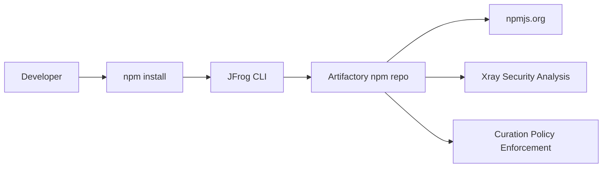

# JFrog npm Supply Chain Security Workshop (Curation Focus)

This workshop demonstrates how to protect the npm software supply chain using:

- JFrog Artifactory
- JFrog Xray
- **JFrog Curation**
- JFrog CLI

The focus of this workshop is **package governance and malicious package prevention using JFrog Curation**.

---

# Workshop Architecture



Artifactory acts as the **central repository** while Curation enforces package governance policies before dependencies reach developers.

---

# Prerequisites

Participants only need:

- Docker
- Git
- Access to a JFrog Platform instance with:
  - Artifactory
  - Xray
  - Curation enabled

All other tools run inside the workshop container.

Included tools:

| Tool | Version |
|-----|------|
| Node.js | 20 |
| npm | latest |
| JFrog CLI | latest |

---


# Build Workshop Environment

The Dockerfile is located in the `workshop` directory.

```bash
docker build -t jfrog-npm-workshop .
```

---

# Start Workshop Container

Start the workshop environment:

```bash
docker run -it --rm jfrog-npm-workshop
```

After the container starts you will be inside the workshop environment.


## Clone Repository

```bash
git clone https://github.com/alexwang66/jfrog-sample.git
cd jfrog-sample/workshop
```


Navigate to the npm sample project:

```bash
cd npm-sample
```

---

# Verify Environment

```bash
node -v
npm -v
jf --version
```

---

# Configure JFrog CLI

Connect the CLI to Artifactory.

```bash
jf config add
```

Example configuration:

```
Server ID: workshop
Artifactory URL: https://artifactory.company.com
User: username
Access Token: ********
```

Verify configuration:

```bash
jf config show
```

---

# Configure npm Repository

Configure npm to resolve dependencies through Artifactory.

```bash
jf npm-config
```

Example configuration:

```
Resolve repository: npm-virtual
Deploy repository: npm-local
```

Dependency flow:

```
Developer
   ↓
npm
   ↓
Artifactory npm-virtual
   ↓
npm-remote
   ↓
npmjs.org
```

---

# Step 1 – Normal Dependency Installation

Navigate to the sample project.

```bash
cd npm-sample
```

Install dependencies:

```bash
jf npm install
```

Dependencies will be downloaded through Artifactory.

---

# Step 2 – Publish Build Info

Publish build metadata to Artifactory.

```bash
jf rt build-publish
```

View build information:

```
Artifactory → Builds
```

Build info includes:

- dependency tree
- modules
- environment metadata

---

# Step 3 – Simulate Malicious Dependency

Edit the demo project:

```
npm-sample/package.json
```

Add the dependency:

```json
"dependencies": {
  "lodash": "^4.17.21",
  "@nx/key": "3.2.0"
}
```

The package **@nx/key@3.2.0** has been flagged in security research as containing malicious behavior.

---

# Step 4 – Attempt Install Again

Run:

```bash
jf npm install
```

If Curation policies are configured correctly, installation will be blocked.

Example output:

```
Package blocked by JFrog Curation policy
```

---

# Step 5 – Investigate Curation Audit Events

Open the JFrog Platform UI.

Navigate to:

```
Curation → Audit Events
```

Example event:

```
Blocked package: @nx/key@3.2.0
Policy: malicious package protection
Repository: npm-virtual
User: workshop
```

This audit event shows:

- blocked dependency
- repository
- policy applied
- requesting user

---

# Step 6 – Investigate via Xray

Navigate to:

```
Xray → Violations
```

From here you can analyze:

- dependency tree
- vulnerability details
- malicious indicators

---

# Learning Objectives

After completing this workshop participants will understand:

### DevOps

- npm dependency proxy through Artifactory
- build-info generation

### Supply Chain Security

- blocking malicious packages using Curation
- enforcing dependency policies
- investigating blocked packages using audit events

---

# Troubleshooting

Verify Node.js:

```bash
node -v
```

Verify npm:

```bash
npm -v
```

Verify JFrog CLI:

```bash
jf --version
```

Ensure your environment can access the Artifactory URL.

---

# Clean Up

Exit container:

```
exit
```

Remove Docker image if necessary:

```
docker rmi jfrog-npm-workshop
```

---

# Resources

JFrog Artifactory  
https://jfrog.com/artifactory/

JFrog Xray  
https://jfrog.com/xray/

JFrog Curation  
https://jfrog.com/platform/curation/

JFrog CLI  
https://jfrog.com/getcli/
